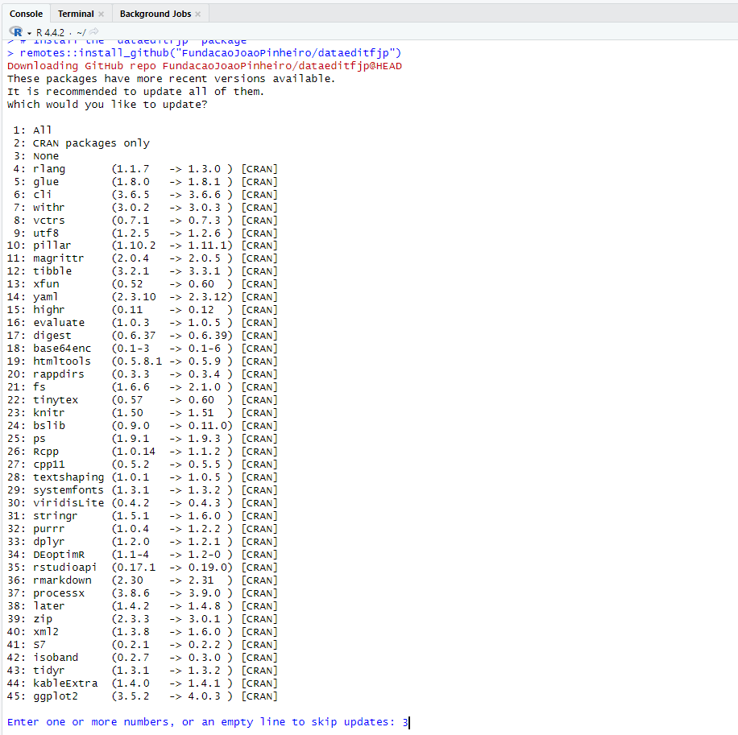
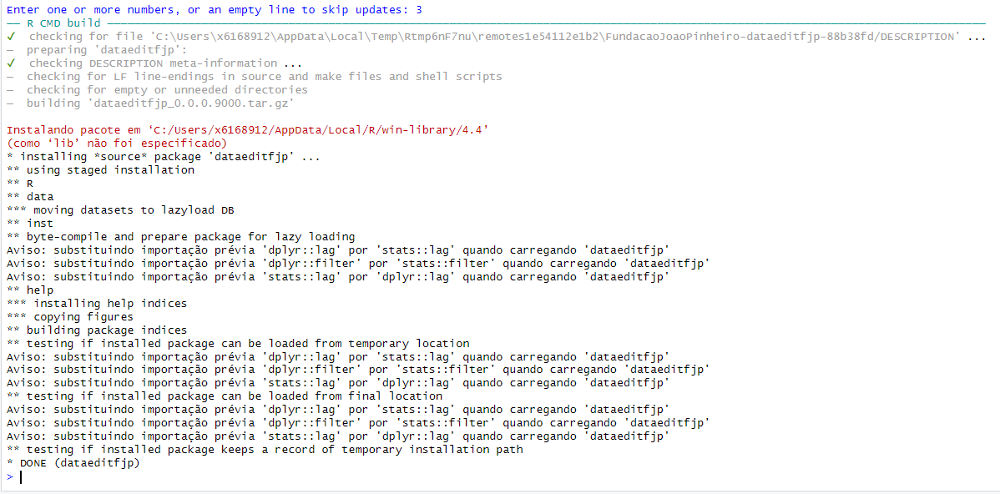
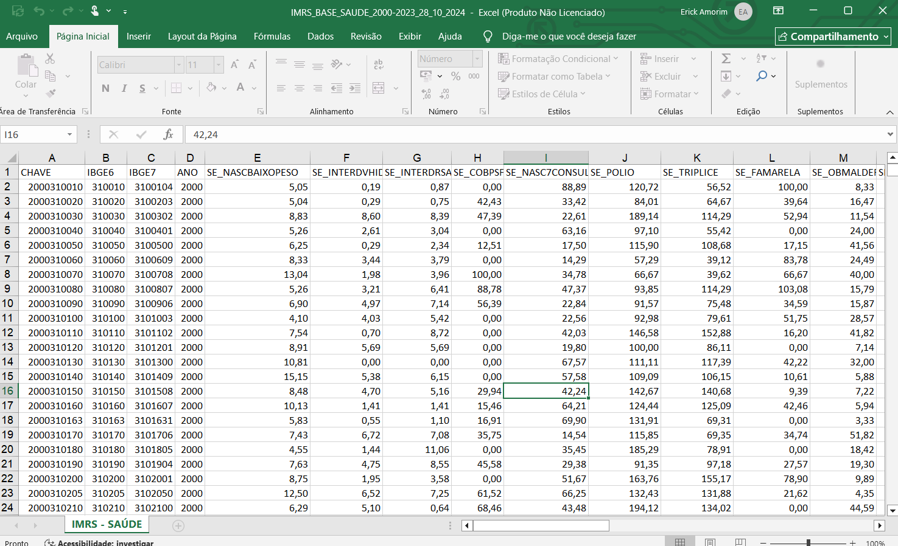
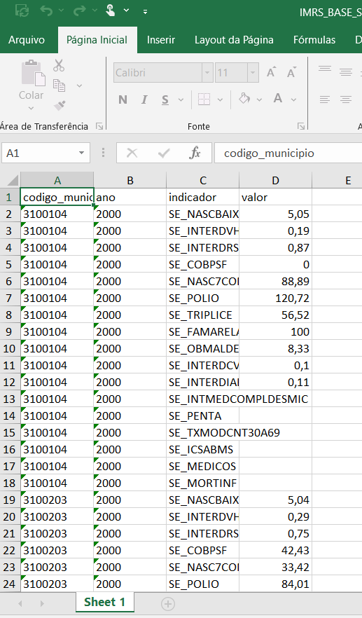
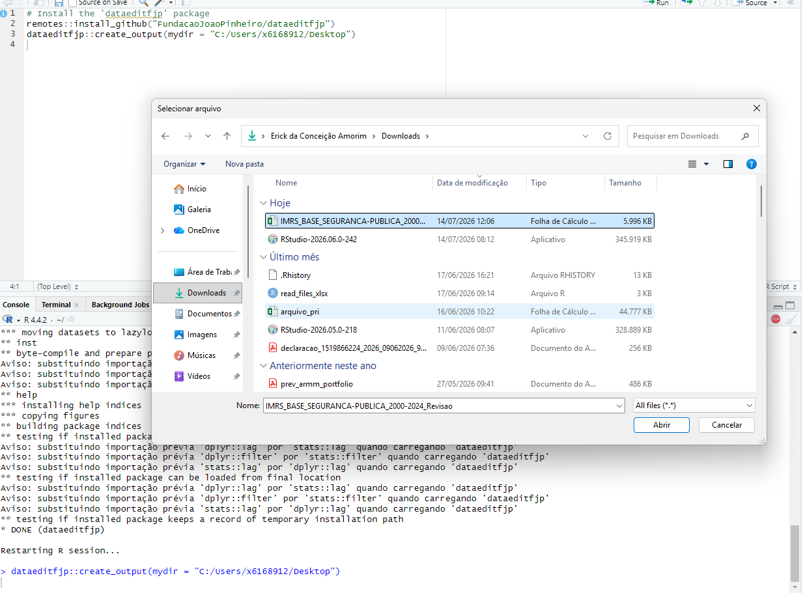
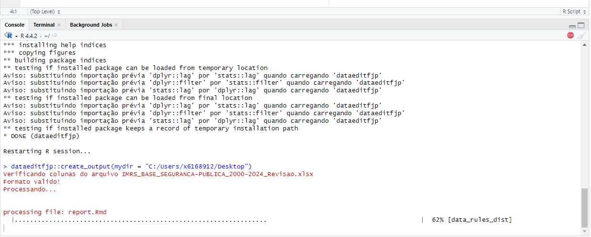
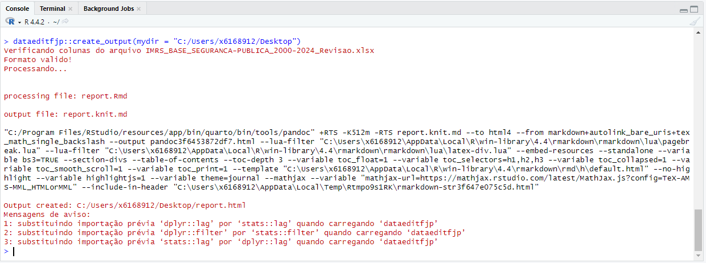

<!-- README.md is generated from README.Rmd. Please edit that file -->

```{r, include = FALSE}
knitr::opts_chunk$set(
  collapse = TRUE,
  comment = "#>",
  fig.path = "man/figures/README-",
  out.width = "100%"
)
```

# dataeditfjp

<!-- badges: start -->
<!-- badges: end -->

The dataeditfjp package aims to facilitate data manipulation, analysis, and report generation, with a focus on applications related to data editing. It was developed to support researchers and analysts at the João Pinheiro Foundation (FJP) and the broader community.

## Installation

You can install the development version of **dataeditfjp** from [GitHub](https://github.com/) with:

```{r eval=FALSE}
#Install the packages if your haven't already
install.packages("pander")
install.packages("remotes")
remotes::install_github("FundacaoJoaoPinheiro/dataeditfjp")
```

If the information appear like the image below, press 3 and enter to continue the installation.







There are two forms of data accepted by the function. They are listed below.
It's important that the variables/indicators have **two-letter** abbreviation plus an **underscore character**. Furthermore, the *IBGE7* and *ANO* column names are mandatory in data format 1. The *IBGE7* must have 7 digits.

**Format 1**



**Format 2**

Here, the column names *codigo_municipio*, *ano*, *indicador* and *valor* are mandatory.




## Usage Example

Here is a basic example showing how to use the package to generate a report:

```{r example, eval=FALSE}
## basic example code
library(dataeditfjp)
dataeditfjp::create_output(mydir = "C:/Users/Área de Trabalho")
```

It's important to specify an **output directory** in the ***mydir*** parameter of the function.If you do not specify, the output directory will be the default. Note: Use the `getwd()` to find out the default directory.


After the `report_output()`function is run, a window appears requesting the data set.



Next, you see the process as shown in the image below.



When execution finishes, **two output files** will be in the output directory.




## Funding

This study was initially developed with financial support from the Research Support Foundation of the State of Minas Gerais (Fapemig) under the project "Building Capacities and Expanding Frontiers in Research at FJP" - Call No. 003/2023. It is currently being developed  with resources and founds from the João Pinheiro Foundation (FJP).

## Team

* Coordination Social Indicators: Ester Carneiro C. Santos
* Unit of Statistics and Data Management: Renato Vale
* Script Development: Erick C. Amorim and Lívia Caroline R. Pereira

## Contributions

Contributions are welcome! If you wish to contribute to the development of this package, please open an issue or a pull request on the GitHub repository or contact us at: [dados@fjp.mg.gov.br]()
